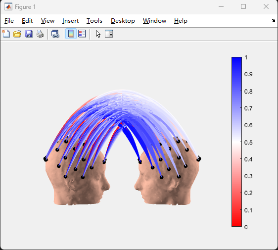

# Howard-Slapjack
An EEG Hyperscanning study creat by **Hao-Che (Howard) Hsu**

## Experimental environment 
* Software base on [Unity](https://unity.com/) and [labstreaminglayer](https://github.com/sccn/labstreaminglayer)
* Using [Tobii eye tracker 5](https://gaming.tobii.com/product/eye-tracker-5/) as eye tracker
* Brainproduct [BrainAmp](https://www.brainproducts.com/solutions/brainamp/) as EEG device

## Experimental paradigms
There are two sessions and three modes
+ **Keyboard Session**
+ **Gaze Session**
> * Single mode
> * Cooperative mode
> * Competitive mode

## Data processing
1. Merged three modes **.xdf** files
2. Separate the EEG signals of two people and two sessions
3. Band-pass filter (1~50Hz) 
4. Resampple (1000 -> 250 Hz)
5. Re-referece (TP9, TP10)
6. ASR (k = 20)
7. ICA
8. ICLabel (keep brain and others)
9. Extract epoch [Keyboard session (-0.3 ~ 1.2s), Gaze session (-3 ~ 10s)]

## Hyplot code

### There are many requirements for this code
1. Already have **[Custom Colormap](https://www.mathworks.com/matlabcentral/fileexchange/69470-custom-colormap/)** in the system.
2. Matlab above 2017b.
3. The input array must 32*32 inter-brain matrix, this code will normalize into 0 to 1. 
4. If you don't want to plot some line replace the corresponded index's value to nan.

### For example usage:
 ```matlab
    load('test_matrix.mat')
    PlotBrain(test_matrix)
```
